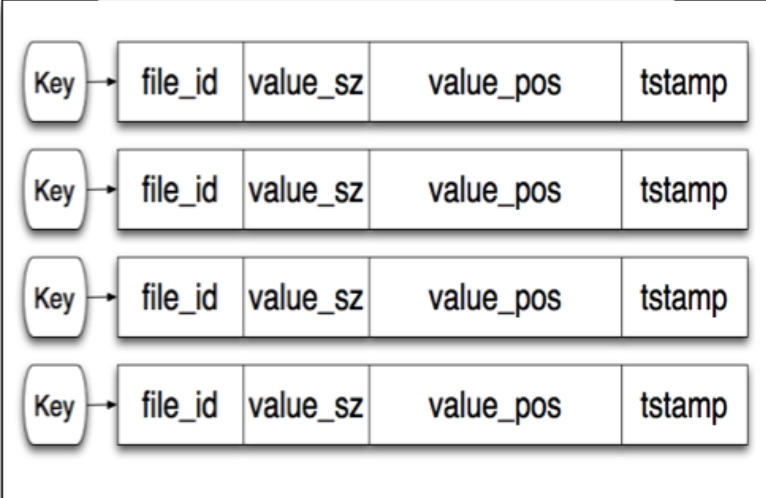
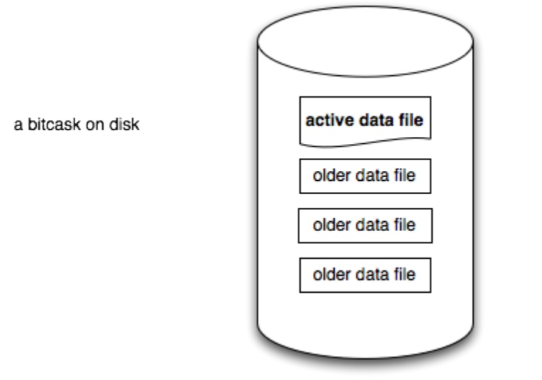

# gokv-Bitcask
Build a simple KV database using Go, which is a simple implementation of Bitcash.

## 说明
基于Bitcask模型的kv存储引擎
## 整体架构
存储引擎的整体架构整体如下图：

内存中放置引索，用直接的方式找到数据
磁盘中存储用户的数据，可以是同构的数据文件（data_file)
bitcask采用的是一种比较简单的形式：内存中会记录每条数据在磁盘中的位置，以及key和value的长度，直接通过一次系统调用在数据存放的位置把它拿出来。

对象：
- Entry ：代表 db 中一条数据的信息。
- Storage：与文件系统交互的对象，包含写入、读取
- Index：引索，记录一条数据的具体信息，主要是数据在磁盘中的位置
- db：db的实体。包含db的各种操作，包括写入、读取数据。
## 数据的编码与解码
在kv存储引擎中一条数据包含有 `meta，key，value`
`meta`：元数据，用于描述作用的数据。
    - `crc`：用于校验数据
    - `position`：
    - `timeStamp`：时间戳，记录数据版本
    - ...
`key、value`：数据内容

## 数据存储与索引
bitcask数据存储：

`active data file`：活动文件，可读写，操作只会写入这个文件里
`older data file`：只读，adf达到阈值后转化而来的文件

实现：把文件名定义成数字，并且在文件存储的数据到达阈值的时候让当前`active data file`的文件名 + 1 变成下一个`active data file`的文件名

索引结构如下，`hashmap`的`key`是存入数据的`key`，`Index`记录了找到这条数据的关键信息，主要是`fid`和`off`，这两个字段连起来含义就是：**数据存在那个文件(fid)的什么位置（off)**

读取数据:
这里`Index`的实现其实和bitcask论文中的不太一样，论文中还会记录`keySize`和`valueSize`，在读取的时候其实**一次**性读取就可以了，用`metaSize+keySize+valueSize`就是**整条数据的长度**。那么我这里为什么不在Index中存储KeySize和ValueSize了呢？主要是为了和奔溃恢复做一个复用，在奔溃回复的场景中，内存里是没有索引信息的，所以需要**两次读取**，一次是读出`meta`，根据`meta`上面记录的`keySize`和`valueSize`，再读取`key`和`value`。

## 并发处理
并发控制的实现，是优化nutsdb并发性能的重大议题。在此不做深入研究，采用的是比较原始的方式。在整个db下面加上一把读写锁，有数据写入的时候就加上写锁，读取数据的时候就加上读锁。其实类似于`mysql innodb`的读提交。

## 数据Merge
写入操作为追加操作，需要设置一个`Merge`操作来清理掉已经无效的操作。
根据`fid`和`off`的判断数据新旧，故`Mergo`操作：
1. 将文件按照名字(除了`active data file`)从小往大读取，文件从头读到尾。
2. 将最新的数据写入到`ative data file`，并更新该数据的索引到最新的写入位置。当一个文件中的所有的最新数据都写入到别的地方，那么意味着这个文件中所有的数据都是旧数据，就可以把这个文件删除掉。

## 崩溃恢复
